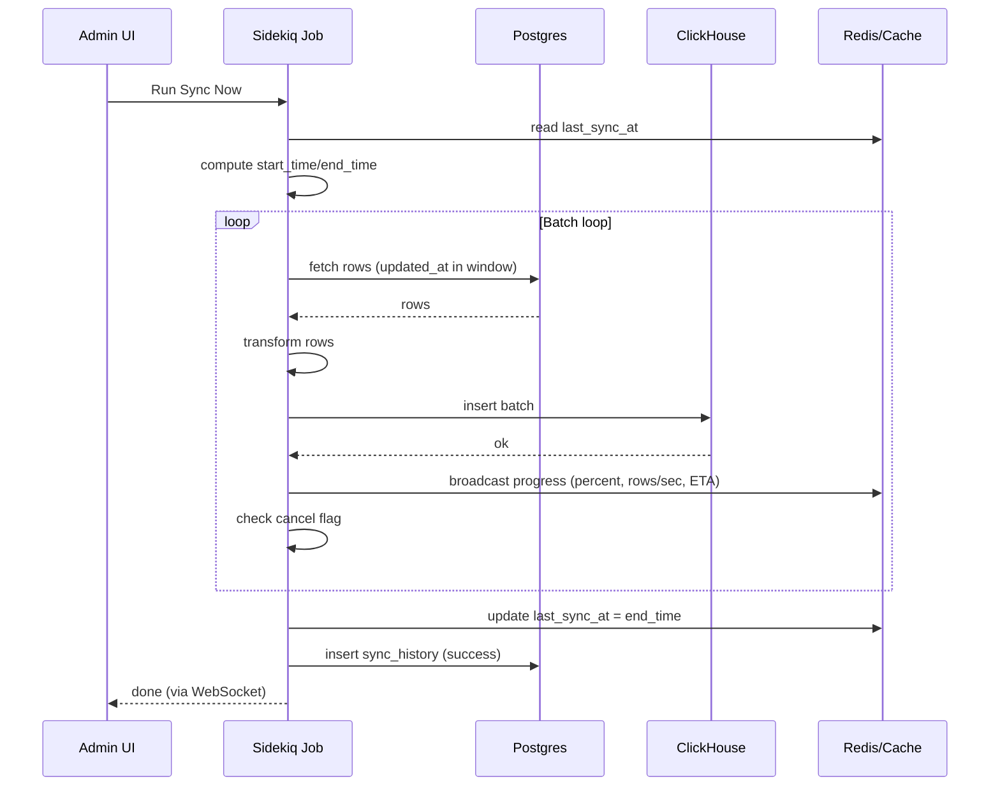
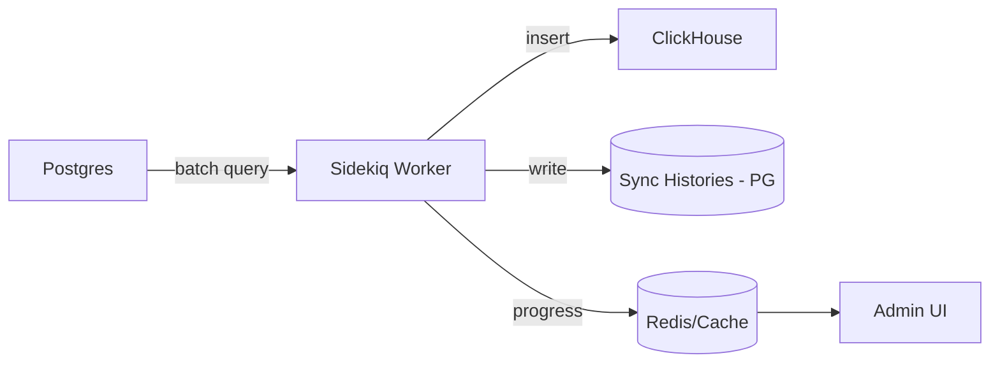

# Thiết kế Pipeline Sync ClickHouse

## 🎯 Mục tiêu

Xây dựng một **data pipeline đáng tin cậy, dễ quan sát (observable) và dễ mở rộng** từ Postgres → ClickHouse phục vụ OLAP.

---

# 1. Nguyên tắc cốt lõi

## 1.1 At-least-once > Exactly-once

* Chấp nhận duplicate
* Đảm bảo không mất dữ liệu
* Deduplicate ở downstream nếu cần

## 1.2 Sync theo state (KHÔNG theo thời gian)

* Track `last_sync_at`
* Tránh pattern `now - N minutes`

## 1.3 Ưu tiên observability

* Mỗi lần sync phải trace được
* Có log tốt > đoán mò

---

# 2. Kiến trúc V1 (Pull-based)

## 2.1 Flow

Postgres → Sidekiq → ClickHouse

## 2.2 Chiến lược sync

```
start_time = last_sync_at - overlap
end_time   = now

fetch WHERE updated_at BETWEEN start_time AND end_time
insert vào ClickHouse

update last_sync_at = end_time
```

## 2.3 Overlap window

Mục đích:

* xử lý delayed write
* xử lý lệch clock
* tránh miss data

---

# 3. Sync History (tầng observability)

## 3.1 Thiết kế

Bảng: `clickhouse_sync_histories`

Fields:

* job_name
* start_time
* end_time
* synced_records_count
* status (success / failed)
* error_message
* created_at

## 3.2 Nguyên tắc

* Append-only (không update)
* Immutable log
* Dùng để debug + monitoring

---

# 4. Failure & Retry Strategy

## 4.1 Xử lý lỗi

* KHÔNG update `last_sync_at` khi fail
* Retry lại từ window cũ

## 4.2 Xử lý duplicate

* Chấp nhận duplicate trong ClickHouse
* Dùng aggregation hoặc ReplacingMergeTree để xử lý
* Quy trình:


```
Postgres (orders, order_items)
        ↓
Sidekiq sync
        ↓
raw.order_items_raw
        ↓
raw.order_items_flat
        ↓
agg.mv_daily_revenue
        ↓
agg.daily_revenue_agg
        ↓
final.daily_revenue_final   ← ONLY ENTRY POINT
```

order_items_raw và order_items_flat có cấu trúc giống nhau. Ta có 2 cases:

Case A — dùng CDC (Kafka)
```
raw.order_items_raw (event-level)
        ↓
transform
        ↓
order_items_flat
```

Case B — schema PG phức tạp
```
orders + order_items + products
        ↓ join
order_items_flat
```

Nếu hiện tại ta chưa dùng case A, chỉ đang dùng case B, thì ở phía client đã denormalize data rồi, nên không cần raw.order_items_raw nữa, chỉ cần tạo raw.order_items_flat là đủ.

```sql
CREATE TABLE raw.order_items_raw
(
    order_id UInt64,
    product_id UInt64,
    quantity UInt32,
    total_price Float64,
    created_at DateTime
)
ENGINE = MergeTree
ORDER BY (order_id, product_id, created_at);

CREATE TABLE raw.order_items_flat
(
    order_id UInt64,
    product_id UInt64,
    quantity UInt32,
    total_price Float64,
    created_at DateTime
)
ENGINE = MergeTree
ORDER BY (order_id, product_id, created_at);
```

===
```sql
CREATE MATERIALIZED VIEW agg.mv_daily_revenue
TO agg.daily_revenue_agg
AS
SELECT
    toDate(created_at) AS date,
    SUM(total_price) AS total_revenue,
    SUM(quantity) AS total_items
FROM raw.order_items_flat
GROUP BY date;
```

Rule:
- luôn prefix mv_
- KHÔNG chứa data cuối

===

```sql
- AGGREGATE TABLE (intermediate)
CREATE TABLE agg.daily_revenue_agg
(
    date Date,
    total_revenue Float64,
    total_items UInt64,
    inserted_at DateTime DEFAULT now()
)
ENGINE = MergeTree
ORDER BY date;
```

Rule:
- có duplicate
- append-only
- KHÔNG expose
===
```sql
CREATE VIEW final.daily_revenue_final AS
SELECT
    date,
    SUM(total_revenue) AS total_revenue,
    SUM(total_items) AS total_items
FROM agg.daily_revenue_agg
GROUP BY date;
```

Usage:
```sql
SELECT * FROM final.daily_revenue_final;
```

# 5. Admin Dashboard (UI quan sát)

## 5.1 Metrics

* Thời điểm sync gần nhất
* Lag (now - last_sync)
* Lịch sử run gần đây
* Số lần fail

## 5.2 Insight

> Visibility = Confidence

---

# 6. Điều khiển thủ công

## 6.1 Run Sync Now

* Trigger Sidekiq job thủ công
* Dùng để debug / retry

## 6.2 Cancel Sync (Cooperative)

Thiết kế:

```
User set cancel flag
Job check flag mỗi batch
Job dừng graceful
```

Nguyên tắc:

> Không kill job, hãy để nó tự dừng an toàn

---

# 7. Progress real-time (WebSocket)

## 7.1 Flow

Sidekiq → ActionCable → Browser

## 7.2 Metrics

* percent
* processed rows
* status (running/done/cancelled)

---

# 8. Thiết kế ETA

## 8.1 ETA cơ bản (theo %)

```
eta = (elapsed / percent) * (100 - percent)
```

## 8.2 ETA nâng cao (theo throughput)

```
rows_per_sec = processed / elapsed
remaining    = total - processed
eta          = remaining / rows_per_sec
```

## 8.3 Smoothing

* Dùng moving average
* Tránh ETA nhảy loạn

---

# 9. Theo dõi throughput

## 9.1 Metrics

* rows/sec
* remaining rows

## 9.2 Mục đích

* phát hiện slowdown
* hiểu performance hệ thống

---

# 9.3 Materialized View & Duplicate Aggregates (ClickHouse)

## Vấn đề

Khi dùng Materialized View để tính aggregate (ví dụ `daily_revenue`), có thể thấy:

* cùng một `date` xuất hiện nhiều dòng
* tổng doanh thu bị “chia nhỏ” thay vì gộp lại

Ví dụ:

```
2026-04-03 | 1000
2026-04-03 | 100
```

## Nguyên nhân

Materialized View trong ClickHouse hoạt động theo cơ chế:

> INSERT → append kết quả mới

KHÔNG phải:

> recompute lại toàn bộ aggregate

Tức là:

* mỗi batch insert → tạo thêm row mới
* không merge với row cũ ngay lập tức

## Mental Model đúng

> Materialized View = stream processor (append-only)
> KHÔNG phải = bảng kết quả cuối cùng

## Cách xử lý

### Cách 1 — Aggregate khi query (recommended V1)

```
SELECT date, SUM(total_revenue)
FROM daily_revenue
GROUP BY date
```

Ưu điểm:

* đơn giản
* đúng ngay lập tức

Nhược điểm:

* phải GROUP BY mỗi lần query

---

### Cách 2 — SummingMergeTree

* tự động cộng các row cùng key khi background merge
* nhưng merge là eventual (không realtime)

---

### Cách 3 — AggregatingMergeTree

* lưu state aggregate (sumState, countState...)
* query bằng sumMerge
* chính xác và tối ưu hơn
* nhưng phức tạp hơn

---

## Kết luận

* Duplicate trong MV là hành vi bình thường
* Không nên cố “fix” ở ingestion
* Nên xử lý ở query hoặc engine

> ClickHouse = append-first, merge-later

---

# 10. Hạn chế hiện tại (V1)

* ETA chỉ approximate
* total estimate có thể sai
* chưa có breakdown (fetch vs insert)

---

# 11. Hướng phát triển (V2)

## 11.1 Pipeline push bằng Kafka

Thay pull bằng event streaming:

Postgres → Kafka → ClickHouse

Ưu điểm:

* gần real-time
* scale tốt
* kiến trúc tách biệt

---

## 11.2 Event schema

Thêm các field:

* event_id
* event_time
* operation_type (c/u/d)
* version

---

## 11.3 Detect slowdown tự động

Trigger alert khi:

```
speed hiện tại << speed baseline
```

Use case:

* DB chậm
* network vấn đề
* ClickHouse insert chậm

---

## 11.4 Breakdown metrics

Track riêng:

* fetch_time
* transform_time
* insert_time

Mục tiêu:

> Xác định bottleneck chính xác

---

## 11.5 Monitoring nâng cao

* alert lag
* detect anomaly (0 records)
* detect spike

---

# 12. Insight quan trọng

## 12.1 Triết lý pipeline

> Pipeline tốt không phải là không lỗi
> mà là lỗi rồi vẫn recover đúng

## 12.2 Observability > Perfection

* Log quan trọng hơn logic hoàn hảo
* Debuggability là yếu tố sống còn

## 12.3 Chiến lược phát triển

* V1: đơn giản, đáng tin
* V2: scalable, event-driven

---

# 13. Tổng kết

V1 mang lại:

* sync ổn định
* retry-safe
* hệ thống có thể quan sát

V2 sẽ mang lại:

* ingestion real-time
* scale tốt hơn
* observability sâu hơn

---

---

# 14. Sequence Diagram (Sync Flow)



---

# 15. Architecture Diagram (V1 vs V2)

## 15.1 V1 (Pull-based)



**Đặc điểm**

* Đơn giản, dễ triển khai
* Có overlap window để tránh miss data
* Phù hợp giai đoạn đầu

---

## 15.2 V2 (Event-driven với Kafka)

```mermaid
flowchart LR
    A[Postgres] -->|CDC/Event| K[Kafka]
    K --> C[ClickHouse (Kafka Engine / Consumer)]
    K --> S[Stream Processor (optional)]
    S --> C
    C --> D[(Aggregations / MV)]
    C --> F[Admin UI]
```

**Đặc điểm**

* Near real-time ingestion
* Decoupled system
* Scale tốt hơn
* Có thể xử lý multi-consumer

---

## 15.3 So sánh nhanh

| Tiêu chí    | V1 (Pull) | V2 (Kafka)    |
| ----------- | --------- | ------------- |
| Độ phức tạp | Thấp      | Cao           |
| Độ trễ      | Phút      | Gần real-time |
| Scale       | Vừa       | Cao           |
| Độ tin cậy  | Tốt       | Rất tốt       |
| Vận hành    | Dễ        | Phức tạp hơn  |

---

**Kết thúc tài liệu**
